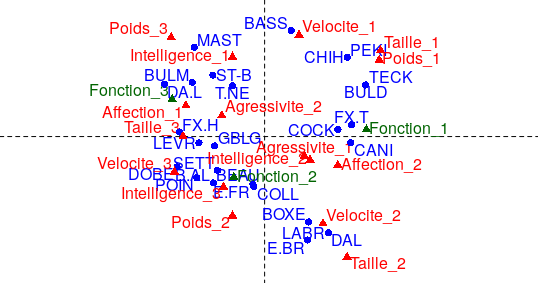

\newpage

```{r setup, include=FALSE}
knitr::opts_chunk$set(echo = TRUE)
```

# Partie 1 : Importation et visualisation des données

Nos données sont sauvegardées au format CSV dans le fichiers race, nous commencons donc par importer les données dans la variable `data` grâce à la fonction suivante :

```{r}
data <- read.table("/home/remi/Documents/Cours/AD/data/race.csv", sep = ",", dec = ".", colClasses = "factor", header = TRUE)
```

On visualise ensuite les types de nos données et la forme de celles-ci grâce à la fonction `str` appliquée à notre variable `data` :

```{r}
str(data)
```

Notre jeu de données comporte 27 obervations, représentant les 27 races de chiens et 8 variables, représentant les 7 modalités et un libellé. On remarque également que toutes les variables sont des variables qualitatives, et ont chacunes 3 niveaux qui sont :

* Faible : 1
* Moyen : 2
* Fort : 3

On se décide alors de visualiser les 6 premières lignes de nos données avec la fonction `head` ;

```{r}
head(data)
```

On remarque que nous devons enlever la colonne `race` avant de lancer les calculs et faire notre analyse, on décide donc de formater nos données afin de donner un identifiant aux différentes lignes de nos données, dans notre cas, ce sera la variable `race` :

```{r}
rownames(data) <- data$Race
data <- data[,-1]
head(data)
```

# Partie 2 : Mise en oeuvre de l'ACM

Pour réaliser l'ACM, nous allons avoir besoin du package FactoMineR :

```{r}
library(FactoMineR)
```

Puis on range les résultats de l'ACM (valeurs propres, coordonnées, contribution) dans la variable `data.mca`, dans notre cas, nous ne retenons que les 5 premiers axes et on souhaite que les graphiques ne soient pas générés lors de l'appel de la fonction :

```{r}
data.mca <- FactoMineR::MCA(data, ncp = 5, quali.sup = c(7), graph = FALSE)
```

Les résultats seront alors stockés dans les variables suivantes :

* `$eig` pour les informations par rapport aux valeurs propres relatives à chaque dimension
* `$var` pour les résultats concernant les différentes modalités de nos variables
* `$ind` pour les informations par rapport aux différents individus, les races de chiens dans notre cas

# Partie 3 : Analyse des résultats

## Nombre d'axe à retenir

Pour rappel, on obtient les valeurs propres des dimensions grâce à la variable suivante :

```{r}
data.mca$eig
```

Pour connaître le nombre d'axe que nous devons retenir, nous pouvons utiliser ces 3 critères :

* Part d'inertie supérieure à la moyenne
* Part d'inertie cumulée supérieure à 80%
* Critère du coude

Nous allons pour chacun de ces critères, déterminer le nombre de composantes principales à retenir.

### Part d'inertie supérieure à la moyenne

Pour utiliser ce critère, on commence par calculer la moyenne des pourcentages des valeurs propres, obtenu grâce à :

```{r}
mean(data.mca$eig[,2])
```

Puis nous retenons les composantes principales dont le pourcentage d'inertie expliqué est supérieur à cette moyenne, dans notre cas, nous pouvons retenir les 5 premières composantes principales en utilisant ce critère.

### Part d'inertie cumulée supérieure à 80%

Pour ce critère, nous devons additionner les valeurs propres des dimensions jusqu'à obtenir un pourcentage cumulé supérieur à 80%, grâce au tableau précédent, nous pouvons retenir les 5 premières composantes qui à elles seules réprésentent un peu plus 84% de l'information totale.

### Critère du coude

Afin d'utiliser ce critère, nous devons dans un premier temps, tracer le graphique suivant :

```{r}
barplot(data.mca$eig[,2])
```

On recherche l'apparition d'un coude, sur notre graphique, le coude apparaît entre le 4e et 5e dimension, donc selon ce critère nous pouvons retenir 4 composantes principales.

### Conclusion sur le nombre d'axe à retenir

Selon les critères, précédents, nous décidons de retenir 5 composantes principales pour notre analyse.

## Analyse des 5 premiers axes en fonction des modalités

On recupère les données (contribution, qualité de représentation et coordonnées) des modalités sur les différentes dimensions grâce à la variable suivante :

```{r}
data.mca$var
```

Pour chacune des 5 dimensions, nous allons retenir les modalités dont la contribution est supérieure à la moyenne (soit 6.25), puis pour chacune des modalités retenues, nous allons noter la qualité de leur répresentation sous cet axe, ainsi que le signe de sa projection.

### Dimension 1

| Modalité | Contribution | Qualité | Signe |
| ----- | ---- | ---- | ---- |
| Poids_1 | 14.01 | 0.58 | + |
| Taille_3 | 13.32 | 0.87 | - |
| Taille_1 | 12.56 | 0.49 | + |
| Affection_1 | 10.75 | 0.60 | - | 
| Affection_2 | 9.98 | 0.60 | + |
| Velocite_3 | 9.76 | 0.43 | - |
| Somme | 70.38 |

Les modalités retenus expliquent 70.38% de l'information portée par la première dimension, de plus cette dimension permet d'opposer les modalités `Poids_1`, `Taille_1`, `Affection_2` aux modalités `Taille_3`, `Affection_1` et `Velocite_3`.
Toutes ces modalités sont bien représentés dans cette dimension (qualité > 0.40) et les contributions de celles-ci sont plutôt bonnes.

### Dimension 2

| Modalité | Contribution | Qualité | Signe |
| ----- | ---- | ---- | ---- |
| Velocite_1 | 17.36 | 0.64 | + |
| Poids_2 | 14.89 | 0.71 | - |
| Taille_2 | 12.24 | 0.34 | - |
| Velocite_2 | 10.24 | 0.34 | - |
| Taille_1 | 8.70 | 0.27 | + |
| Intelligence_ 1 | 8.53 | 0.28 | + | 
| Somme | 71.96 |

Les modalités retenus représentent 71.96% de l'information totale expliquée par cet axe, il permet d'opposer les modalités `Velocite_1`, `Taille_1` et `Intelligence_1` aux modalités telles que `Poids_2`, `Taille_2` et `Velocite_2`.

Par rapport à la dimension précédente, seules 2 modalités sont bien représentés sur cet axe (`Velocite_1` et `Poids_2`) dont les contributions sont les plus élévées, les autres modalités ne sont pas très bien représentés par rapport aux 2 autres modalités. Les contributions de ces modalités sont quant à elles dans la moyenne.

### Dimension 3

| Modalité | Contribution | Qualité | Signe |
| ----- | ---- | ---- | ---- |
| Poids_3 | 20.71 | 0.37 | +
| Velocite_3 | 14.14 | 0.28 | - | 
| Intelligence_2 | 13.21 | 0.32 | - | 
| Intelligence_3 | 10.37 | 0.18 | + |
| Taille_1 | 8.68 | 0.16 | - |
| Somme | 67.44 |

Ces 5 modalités expliquent 67.44% de l'information portée par le 3e axe, cet axe permet d'opposer les modalités `Poids_3` et `Intelligence_3` aux modalités `Velocite_3`, `Intelligence_2` et `Taille_1`.
A part les 2 modalités `Intelligence_3` et `Taille_1` qui ne sont pas très bien représentés (0.18 et 0.16 de cos2), les autres modalités sont bien représentés et leurs contributions sont bonnes.
 
### Dimension 4

| Modalité | Contribution | Qualité | Signe |
| ----- | ---- | ---- | ---- |
| Agressivite_2 | 27.74 | 0.53 | + |
| Agressivite_1 | 25.76 | 0.53 | - |
| Intelligence_3 | 21.22 | 0.28 | + |
| Intelligence_2 | 9.01 | 0.16 | - |
| Somme | 83.73 |

Seules 4 modalités permettent d'expliquer plus de 83% de l'information portée par la dimension 4, celle-ci oppose les modalités `Agressivite_2` et `Intelligence_3` aux modalités `Agressivite_1` et `Intelligence_2`.
On remarque que 3 des 4 modalités ont une contribution supérieure à 20% sur cet axe, mais seulement 2 de ces modalités, `Agressivite_2` et `Agressivite_1`, sont extremement bien représentés (> 0.50), ces 2 modalités expliquent donc l'axe.

La modalité `Intelligence_3` malgré une forte contribution, n'est pas très bien représentée (< 0.30), on pourrait d'ailleurs enlever la modalité `Intelligence_2` du tableau ci-dessus car sa contribution et sa qualité de représentation sur cet axe sont faible par rapport aux autres modalités.

### Dimension 5

| Modalité | Contribution | Qualité | Signe |
| ----- | ---- | ---- | ---- |
| Intelligence_1 | 41.63 | 0.52 | + |
| Intelligence_3 | 20.16 | 0.24 | - |
| Velocite_2 | 9.40 | 0.12 | + |
| Poids_3 | 6.65 | 0.07 | - |
| Somme | 77.84 |

Les modalités retenus permettent d'expliquer 77.84% de l'information portée par la dimension 5, cette dimension permet d'opposer les modalités `Intelligence_1` et `Velocite_2` aux modalités `Intelligence_3` et `Poids_3`.
La modalité `Intelligence_1` se démarque des autres modalités retenus de par sa contribution élevée ainsi que sa qualité de représentation excellente (> 0.5), la seconde modalité contribuant le plus à cette axe est également une modalité de la variable Intelligence mais sa contribution est 2 fois moins élevée, tout comme sa qualité de représentation.

Les autres modalités retenus sur cette dimension, `Velocite_2` et `Poids_3`, ont une faible contribution et ne sont pas du tout bien représentées, on pourrait décider de les enlever et de ne garder que les modalités de la variable Intelligence.

## Analyse des axes par rapport aux variables

Pour chacun des axes que nous avons retenus, nous allons cumuler la somme des contributions des modalités pour chaque variables et voir pour chaque dimension quelles sont les variables qui y contribuent le plus.

Nous avons 6 variables différentes, on ne retiendra donc que les variables ayant une contribution supérieure à la moyenne qui est de :

```{r}
100/6
```

### Dimension 1

| Variable | Contribution |
| ----- | ---- |
| Taille | 30.4 |
| Poids | 21.7 |
| Velocite | 14.2 |
| Intelligence | 5.9 |
| Affection | 20.65 |
| Agressivite | 6.1 |

A part les variables `Intelligence` et `Agressivite`, toutes les autres variables contribuent à cette dimension de manière à peu près égales (à part la variable `Poids` qui prédomine un peu)

### Dimension 2

| Variable | Contribution |
| ----- | ---- |
| Taille | 20.7 |
| Poids | 30.9 |
| Velocite | 29.3 |
| Intelligence | 12.5 | 
| Affection | 4 |
| Agressivite | 1.6 |

Dans le cas de la dimension 2, ce sont les variables `Poids` et `Velocite` qui y contribuent le plus (~30%) vient ensuite la variable `Taille` puis `Intelligence` avec respectivement 20.7% et 12.5%.

### Dimension 3

| Variable | Contribution |
| ----- | ---- |
| Taille | 22 |
| Poids | 26.2 |
| Velocite | 21.1 |
| Intelligence | 25.5 |
| Affection | 2 |
| Agressivite | 2.5 |

Les variables `Affection` et `Agressivite` ne contribuent quasiment pas à la dimension 3, tandis que les autres variables contribuent quasiment de manière égale.

### Dimension 4

| Variable | Contribution |
| ----- | ---- |
| Taille | 5.2 |
| Poids | 2.5 |
| Velocite | 2.3 |
| Intelligence | 30.6 |
| Affection | 5.2 |
| Agressivite | 53.4 |

Cette fois-ci, seules les variables `Agressivite` et `Intelligence` contribuent à cette dimension, nous pouvons négliger le reste des variables étant donné que leurs contributions sont inférieures à la moyenne calculée précedemment.

### Dimension 5

| Variable | Contribution |
| ----- | ---- |
| Taille | 3 |
| Poids | 8.7 |
| Velocite | 13.8 |
| Intelligence | 65.1 |
| Affection | 2.3 |
| Agressivite | 6 | 

Tout comme l'axe précédent, nous avons seulement 2 variables qui contribuent d'une manière significative, dont une qui explique 65.1% de l'information portée par cet axe, la variable `Intelligence`.

## Analyse des 5 premiers axes en fonction des individus

Nous allons reprendre la même méthode que précédemment mais en l'appliquant aux individus et non plus aux modalités, dans ce cas on utilisera les données suivantes :

```{r}
data.mca$ind
```

Comme précédemment, pour chaque dimension, on ne garde que les races canines ayant une contribution supérieure à la moyenne qui est de :

```{r}
mean(data.mca$ind$contrib[,1])
```

### Dimension 1

| Individu | Contribution | Qualité | Signe |
| ----- | ---- | ---- | ---- |
| BULD | 8.17 | 0.64 | + |
| TECK | 8.17 | 0.64 | + |
| DA.L | 8 | 0.53 | - |
| DOBE | 6.13 | 0.55| - |
| FX.T | 6.06 | 0.44 | + |
| CANI | 5.93 | 0.38 | + |
| CHIH | 5.45 | 0.38 | + |
| PEKI | 5.45 | 0.38 | + |
| FX.H | 5.83 | 0.55 | - |
| COCK | 4.30 | 0.28 | + |
| BULM | 4.20 | 0.27 | - |
| Somme | 67.69 |

Les races retenus permettent d'expliquer plus de 67% de l'information portée par la première dimension, sur cette dimension, les races BULD, TECK, FX.T, CANI, CHIH, PEKI et COCK aux races DA.L, DOBE, FX.H et BULM.
Sur cette dimension, les cos2 sont plutôt bon et les contributions sensiblement égales.

### Dimension 2

| Individu | Contribution | Qualité | Signe |
| ----- | ---- | ---- | ---- |
| BASS | 11.38 | 0.62 | + |
| E.BR | 10.83 | 0.54 | - |
| LABR | 9.36 | 0.54 | - |
| DAL | 9.36 | 0.54 | - |
| MAST | 8.04 | 0.43 | + |
| BOXE | 7.37 | 0.42 | - |
| PEKI | 6.35 | 0.35 | + |
| CHIH | 6.35 | 0.35 | + |
| Somme | 69.04 |

Ces 8 races canines expliquent un peu moins de 70% de l'information totale portée par le second axe, cet axe oppose les races BASS, MAST, PEKI et CHIH aux races E.BR, LABR, DAL, BOXE.
A part les races PEKI et CHIH qui sont un peu moins bien représentés par rapport aux autres individus, le reste des qualités de représentations sont plutôt bonnes.

### Dimension 3

| Individu | Contribution | Qualité | Signe |
| ----- | ---- | ---- | ---- |
| ST-B | 13.75 | 0.47 | + |
| T.NE | 10.03 | 0.35 | + |
| BOXE | 7.23 | 0.23 | + |
| CANI | 6.64 | 0.19 | - |
| POIN | 6.01 | 0.25 | - |
| BEAU | 5.72 | 0.23 | - |
| B.AL | 5.72 | 0.23 | - |
| MAST | 5.54 | 0.17 | + |
| COCK | 5.18 | 0.15 | + |
| LABR | 4.62 | 0.15 | + |
| Somme | 70.44 |

Les races retenus au-dessus permettent d'expliquer 70.44% de l'information portée par la dimension 3, cette dimension met en avant l'opposition entre les races ST-B, T.NE, BOXE, MAST, COCK, LABR aux races canines CANI, POIN, BEAU et B.AL.
On remarque que par rapport aux races ST-B et T.NE, les autres races canines ne contribuent pas significativement et ne sont pas très bien représentés sur cet axe. 

### Dimension 4

| Individu | Contribution | Qualité | Signe |
| ----- | ---- | ---- | ---- |
| SETT | 13.8 | 0.52 | - |
| LEVR | 9.3 | 0.30 | - |
| E.FR | 8.6 | 0.31 | - |
| BULM | 7.9 | 0.17 | + |
| COLL | 7.9 | 0.31 | - |
| T.NE | 7 | 0.18 | - |
| BEAU | 6.9 | 0.21 | + |
| B.AL | 6.9 | 0.21 | + |
| COCK | 5.2 | 0.11 | + |
| Somme | 73.5 |

Les 9 races retenus expliquent 73.5% de l'information portée par la dimension 4, sur cette dimension les races BULM, BEAU, B.AL et COCK sont négativement corrélés aux races SETT, LEVR, E.FR, COLL et T.NE.

On remarque que les races négativement représentés dans cette dimension, ont des contributions élévés et une bonne qualité de réprésentation (sauf pour la race T.NE mais cela est du à sa forte contribution à l'axe précédent), tandis que les races positivement représentés ont une contribution faible et une mauvaise qualité de représentation (ces races apparaissent avec une meilleur représentation dans d'autres axes).

### Dimension 5

| Individu | Contribution | Qualité | Signe |
| ----- | ---- | ---- | ---- |
| GBLG | 20.6 | 0.57 | + |
| FX.H | 10 | 0.29 | + |
| BULM | 10 | 0.20 | - |
| T.NE | 8.6 | 0.20 | - |
| BASS | 7.2 | 0.15 | + |
| Somme | 56.4 |

Ces 5 races expliquent 56.4% de l'information totale portée par le dernier axe que nous retenons, il met en opposition les races GBLG, FX.H et BASS aux races canines BULM, T.NE.

On décide de ne retenir que 5 races malgré le fait qu'elles ne représentent que 56% de l'information totale de notre dimension car les autres races contribuent très faiblement et leurs qualités de représentations n'est pas assez bonne pour être retenu.

On remarque qu'une race se démarque des autres dans cette dimension, c'est la race GBLG qui contribue à plus de 20% et qui est très bien représenté, c'est la première fois que cette race apparaît dans l'analyse des axes factoriels que nous avons retenu, dans le cas des autres races retenus, elles ne sont pas forcèment très bien représentés car elles apparaissent dans d'autres axes.
On pourrait donc choisir de ne retenir que 4 axes et de mettre la race GBLG en individu supplémentaire lors de l'ACM.

## Interprétation du premier plan factoriel

On peut obtenir les projections des marques et des attributs dans le premier plan factoriel grâce à :

```{r}
plot.MCA(data.mca, axes = c(1, 2))
```

D'après ce plan, on pourrait regrouper les races canines en 4 groupes différents :



Voici le détail de chaque groupe :

* Un premier regroupant les chiens de petites tailles et de poids faibles et pas très rapide avec des races comme BASS, PEKI, CHIH, BULD, FX.T, COCK et CANi.
PLutôt des chiens de compagnies
* Un second regroupant les races BOXE, DAL, E.BR, LABR qui sont des races canines de taille et de rapidité moyenne
* Un troisième regroupant les races canines de grande taille et de poids important mais peu affectif, tel que MAST, DA.L ou ST-B
* Puis un dernier groupe avec des races comme LEVR, DOBE ou BEAU, qui sont des races rapides, intelligentes et de poids moyen

# Partie 3 : Clasification ascendate hiérarchique sur les axes retenus

Pour rappel, nous avons retenus les 5 premiers axes factoriels qui représentent 84% de l'information totale. Notre classification se portera donc seulement sur ces axes.

## Réalisation sous R

Pour notre étude, nous aurons besoins des librairies suivantes :

```{r}
library(ggplot2)
library(plyr)
library(philentropy)
library(factoextra)
```

On stocke ensuite les résultats de la CAH dans la variable `data.hcpc` et on décide de ne pas afficher les graphiques lors de l'appel à la fonction :

```{r}
data.hcpc <- FactoMineR::HCPC(data.mca, nb.clust = 4, proba = 1, graph = FALSE)
```

## Interprétation et analyse des résultats

### Interprétation du graphique de gain d'inertie

Avant d'interpréter les résultats de la classification, on décider d'afficher le graphique de gain d'inertie par le nombre de classe retenu, obtenu par le code :

```{r}
plot(data.hcpc, choice = "bar")
```

On remarque que nous avons choisi le bon nombre de classes pour la classification, en effet, le coude apparaît à la 3e barre, donc il faut choisir de faire une classification en 4 classes

### Typologie en 4 classes

Pour visualiser la coupure de l'arbre en 4 classes, on utilise la fonction suivante :

```{r}
plot(data.hcpc, choice = "tree")
```

On distingue 4 groupes principaux :

* Le premier groupe formé des races : DA.L, MAST, BULM, ST-B et T.NE
* Un second formé des races : POIN, DOBE, BEAU, B.AL, E.FR, SETT, COLL, LEVR, FX.H, GBL.G
* Un autre par les races : DAL, LABR, E.BR et BOXE
* Puis le dernier par : BASS, CHIH, PEKI, TECK, BULD, CANI, COCK, FX.T

### Analyse des variables les plus explicatives pour les 4 classes

On se décide d'abord de déterminer quelles seront les variables qui seront les plus explicatives pour l'analyse des 4 classes, pour cela on utilise la p.value de nos variables :

```{r}
data.hcpc$desc.var$test.chi2
```

On remarque que les races canines seront divisés en classe principalement par rapport à la variable Poids, Taille et Vélocité, les autres variables.

### Caractérisation des 4 classes en fonction des différentes modalités

Pour chaque classe determinée au dessus, on décide de les caractériser en fonction des modalités actives, c'est à dire en fonction de leur taille, poids, vélocité, intelligence, affection et aggressivité.

#### Classe 1

Pour la classe 1, les données sont obtenus par :

```{r}
data.hcpc$desc.var$category$'1'
```

our la première classe, on remarque que ce sont des races de chiens de grande taille et lourd (100% sont representés), et qui dans les autres modalités sont plutôt moyen, ce sont des chiens qui ne sont pas rapide et ne sont pas affectueux.

#### Classe 2

Pour la seconde classe, les données sont obtenus grâce au code suivant :

```{r}
data.hcpc$desc.var$category$'2'
```

La seconde quant à elle regroupe des chiens de grande taille, de poids moyen (proportion de la classe supérieure à la proportion totale), mais possédant une intelligence et une vélocité élevée, concernant l'affection, on ne peut pas retenir cette modalité car la proportion par rapport à la classe est quasiment égale à la proportion totale de cette modalité

#### Classe 3

Pour la classe 3, les données sont obtenus par la variable :

```{r}
data.hcpc$desc.var$category$'3'
```

La troisième classe regroupe les races canines dont les modalités sont toutes moyennes dans l'ensemble (surtout pour la taille, la vitesse, l'affection et le poids)

#### Classe 4

Pour la dernière classe, les données sont obtenus grâce à :

```{r}
data.hcpc$desc.var$category$'4'
```

La dernière classe est caractérisée par les races de petites tailles et donc de poids faible (100% des individus de cette classe ont ces modalités), de vélocité faible et plutôt affectif, les autres modalités ne peuvent être retenus à cause de la p.value qui est trop élévée (> à 5%)

On représente ensuite l’histogramme des pourcentages des modalités dans la classe et dans
l’échantillon afin de donner une première tendance de la typologie de chaque classe :

#### Dimension 1

```{r}
barplot(data.hcpc$desc.var$category$`1`[,1])
```

#### Dimension 2

```{r}
barplot(data.hcpc$desc.var$category$`2`[,1])
```

#### Dimension 3

```{r}
barplot(data.hcpc$desc.var$category$`3`[,1])
```

#### Dimension 4

```{r}
barplot(data.hcpc$desc.var$category$`4`[,1])
```

### Analyse du plan factoriel

On représente graphiquement sur le plan factoriel 1 & 2, la projection :

* Des 4 classes
* Des 3 modalités de la variable `FONCTION`
* De l'ensemble des races canines

Pour cela, on utilise le code suivant :

```{r}
pl1 <- factoextra::fviz_cluster(data.hcpc, ellipse = FALSE)
factoextra::fviz_add(pl1, data.mca$quali.sup$coord)
```

On remarque qu'à part le groupe 3, tout les autres groupes sont caractérisés par une modalité de la variable Fonction :

* X pour le groupe 1, qui regroupe des chiens de grande taille et lourd
* X pour le groupe 2, ce groupe regroupe les races canines de grande taille et de poids moyens, mais qui possède une velocité élevée
* Enfinx X pour le groupe 4, ce groupe est formé de chiens de petite taille et de poids faible, qui ne sont pas très rapide mais plutôt affectueux.

A l'aide du graphique précédent, on décide de noter les races canines les plus proches du centre de gravité de chaque classe, on obtient les résultats suivants :

* Pour la classe 1, ce sont les races canines BULM, ST-B, MAST
* Pour la classe 3, toutes les races canines sont proches du centre de gravité de la classe
